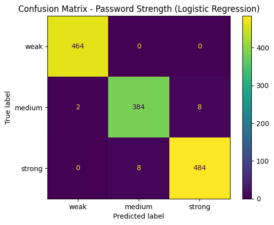
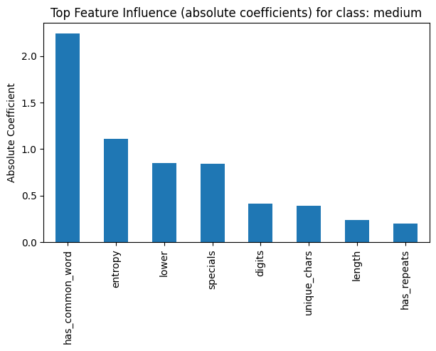
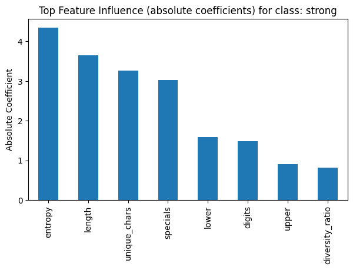

# Machine Learning Password Strength Estimator

## Course
AI and ML for Cybersecurity

## Lecturer
Paata Gogishvili

## Team Members
- Nika Chorgoliani
- Grigol Mikadze
- Guram Lomidze

---

## Project Overview
This project presents a practical application of **Machine Learning in Cybersecurity** by implementing a **Password Strength Estimator**.  
The system automatically classifies passwords into strength categories (**weak, medium, strong**) using supervised machine learning techniques.

Traditional rule-based password validation methods are limited and often fail to reflect real-world password security. This project demonstrates how AI and ML approaches provide a more adaptive and data-driven solution.

---

## Dataset
A **synthetically generated dataset** was used to simulate real-world password behavior.  
Passwords were labeled based on length, entropy, character diversity, and common pattern analysis.

### Extracted Features
- Password length  
- Uppercase letter count  
- Lowercase letter count  
- Digit count  
- Special character count  
- Character diversity ratio  
- Estimated entropy  
- Common word indicator  
- Repeated character patterns  
- Sequential patterns  

---

## Machine Learning Method
The project uses **Logistic Regression**, a supervised classification algorithm well-suited for structured cybersecurity problems.

**Why Logistic Regression?**
- Interpretable and mathematically explainable  
- Efficient for multiclass classification  
- Commonly used in academic ML applications  

A **70/30 train-test split** was applied.  
Model performance was evaluated using accuracy, confusion matrix, and classification report.

---

## Implementation
The solution is implemented in **Python** using:
- pandas
- numpy
- scikit-learn
- matplotlib
- joblib

A complete ML pipeline was created, including:
- Feature extraction  
- Data scaling  
- Model training and evaluation  

---

## Results
The trained model demonstrated strong classification performance and effectively distinguished password strength levels based on complexity and entropy.

Example predictions:
- `password123` → strong  
- `welcome2026` → strong  
- `N!ka-2026@StrongPass` → strong  
- `aB3$kL9@zQ1#` → strong  

The results confirm that machine learning provides a more flexible and intelligent approach compared to traditional rule-based password validation.

---

## Saved Model
The trained model pipeline is stored as:

```
password_strength_lr_model.joblib
```


This allows reuse of the model without retraining.

---

## How to Run (Google Colab)
1. Open Google Colab  
2. Upload or open `password_strength_estimator.ipynb`  
3. Run all cells sequentially  
4. The model will train, evaluate, and save automatically  

---

## References
- Bishop, C. M. *Pattern Recognition and Machine Learning*. Springer, 2006  
- NIST SP 800-63B: Digital Identity Guidelines  
- Pedregosa et al., “Scikit-learn: Machine Learning in Python,” JMLR, 2011  

---

## License
This project was created for academic purposes.

## Results Visualization

### Confusion Matrix


### Feature Importance (Logistic Regression)

**Weak**


**Medium**


**Strong**


